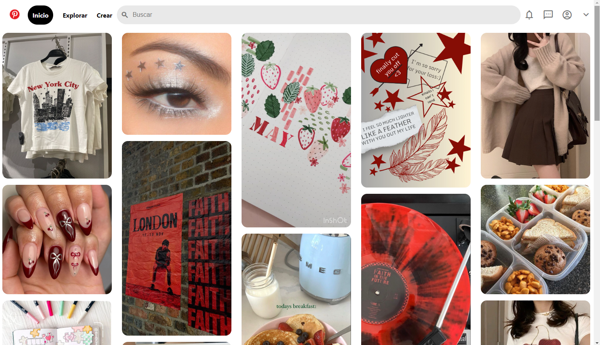

# Clone de Pinterest con HTML y CSS
Este proyecto es una copia de la interfaz de usuario de la página de Pinterest, utilizando solamente con HTML5 y CSS3.

Se enfoca en replicar la apariencia visual de Pinterest, ofreciendo una experiencia de navegación similar con un diseño responsive y funcionalidades básicas.

### Características

* **Diseño responsive:** Adaptable a diferentes tamaños de pantalla para una experiencia de usuario óptima en dispositivos móviles y de escritorio.

* **Interfaz de usuario intuitiva:** Inspirada en Pinterest con una navegación fácil y accesible.

* **Intereacciones dinámicas:** Efectos visuales para elementos interactivos como botones y enlaces.

* **Iconografía y estilos modernos:**  Uso de la biblioteca de íconos de Material Design y estilos CSS modernos para una mejor apariencia.

### Tecnologías utilziadas
+ **HTML5:** Para la estructura básica del sitio.
+ **CSS3:** Para el diseño y el estilo incluyendo, _flexbox_ para un diseño responsivo y efectos de _hover_.

### Vista previa del proyecto

### Contacto
Si te gustaría invitarme a colaboar en un proyecto, contáctame a berenisezm@gmail.com
